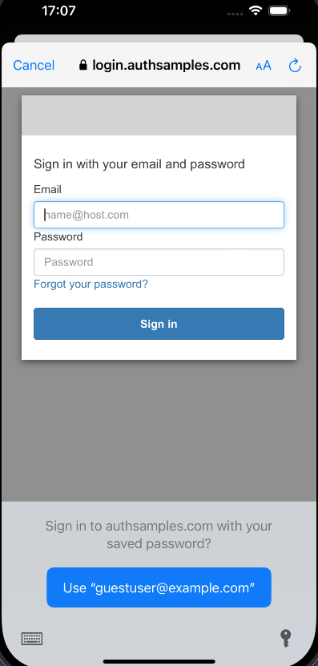

# iOS OAuth Mobile Sample

[](https://www.codacy.com/gh/gary-archer/oauth.mobilesample.ios/dashboard?utm_source=github.com&amp;utm_medium=referral&amp;utm_content=gary-archer/oauth.mobilesample.ios&amp;utm_campaign=Badge_Grade)

## Overview

* A mobile sample using OpenID Connect and AppAuth, referenced in my blog at https://authguidance.com
* **The goal is to implement OpenID Connect mobile logins with best usability and reliability**

## Views

The app is a simple UI with some basic navigation between views, to render fictional resources.\
The data is returned from an API that authorizes access to resources using domain specific claims.


## Local Development Quick Start

Open the app in XCode and ensure that the provisioning profile at `Security/BasicMobileAppProfile` is selected.\
The run the app on an emulator, to trigger an OpenID Connect login flow using the AppAuth pattern.\
The login runs in the system browser using an `AsWebAuthenticationSession` window.\
This ensures that the app cannot access the user's credentials:



You can login to the app using my AWS Cognito test account:

```text
- User: guestuser@mycompany.com
- Password: GuestPassword1
```

An HTTPS redirect URI of `https://mobile.authsamples.com/basicmobileapp/oauth/callback` is used to receive the login response.\
This requires a deep linking assets file to be registered at https://mobile.authsamples.com/.well-known/apple-app-site-association.\
An interstitial web page is also used, to ensure that there is a user gesture, so that the return to the app is allowed by the system.\
You can then test all lifecycle operations, including token refresh, expiry events and logout.

## Further Information

Further architecture and non-functional details are described starting in the [iOS Code Sample Overview](https://authguidance.com/2020/02/22/ios-code-sample-overview/) blog post.

## Programming Languages

* Xcode and SwiftUI are used to develop an app that connects to a Cloud API and Authorization Server

## Infrastructure

* [AppAuth-iOS](https://github.com/openid/AppAuth-iOS) is used to implement Authorization Code Flow (PKCE) with a Claimed HTTPS Scheme
* AWS API Gateway is used to host the back end OAuth Secured Web API
* AWS Cognito is used as the default Authorization Server for the Mobile App and API
* The iOS Keychain is used to store encrypted tokens on the device after login
* AWS S3 and Cloudfront are used to serve mobile deep linking asset files and interstitial web pages
