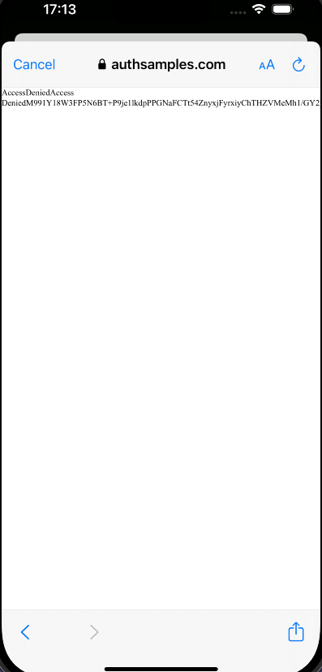

# iOS OAuth Mobile Sample

[](https://app.codacy.com/gh/gary-archer/oauth.mobilesample.ios?utm_source=github.com&utm_medium=referral&utm_content=gary-archer/oauth.mobilesample.ios&utm_campaign=Badge_Grade)

## Overview

A demo mobile app using OpenID Connect, which aims for the best usability and reliability.

## Views

The app is a simple UI with some basic navigation between views, to render fictional investment resources.\
Its data is returned from an OAuth-secured API that uses claims-based authorization.\
The app uses user attributes from both the OpenID Connect userinfo endpoint and its API. 


## Local Development Quick Start

Open the app in Xcode and run the app on a simulator, to trigger an OpenID Connect login flow.\
This triggers an OpenID Connect code flow to authenticate the user with the AppAuth pattern.\
Logins run in the system browser using a `AsWebAuthenticationSession` and the app cannot access the user's credentials:


You can sign in to the app using my AWS Cognito test account:

```text
- User: guestuser@example.com
- Password: GuestPassword1
```

The app receives the login response using a claimed HTTPS scheme redirect URI, in the most secure way.\
iOS Universal Links enables the claimed HTTPS scheme redirect URI and requires a cloud hosted deep linking assets file.\
External web pages ensure a user gesture after login and logout, so that responses return to the app reliably.\
After login you can test all lifecycle operations, including token refresh, expiry events and logout.

## Further Information

* See the [API Journey - Client Side](https://github.com/gary-archer/oauth.blog/tree/master/public/posts/api-journey-client-side.mdx) for further information on the app's behaviour.
* See blog posts for further details specific to the iOS app, starting in the [Code Sample Overview](https://github.com/gary-archer/oauth.blog/tree/master/public/posts/ios-code-sample-overview.mdx).

## Deep Linking Registration Failures

Some developers may run into the following error after login, where the deep link fails to invoke the mobile app.\
Instead, the URL invoked by [this JavaScript](Web/postlogin.html) runs in the browser, resulting in a `Not Found` error:



If you run into this type of problem, see the [iOS Code Sample – Infrastructure](https://github.com/gary-archer/oauth.blog/tree/master/public/posts/ios-code-sample-infrastructure.mdx) blog post on ways to resolve it.

## Programming Languages

* The app's code uses Swift and its views use SwiftUI.

## Infrastructure

* [AppAuth-iOS](https://github.com/openid/AppAuth-iOS) implements the code flow with PKCE.
* [AWS Serverless](https://github.com/gary-archer/oauth.apisample.serverless) or Kubernetes is used to host remote API endpoints that the app calls.
* AWS Cognito is the default authorization server for the app and API.
* The iOS Keychain stores tokens on the device and isolates this data from other apps.
* AWS S3 and Cloudfront serve mobile deep linking asset files and external web pages that receive login responses.
